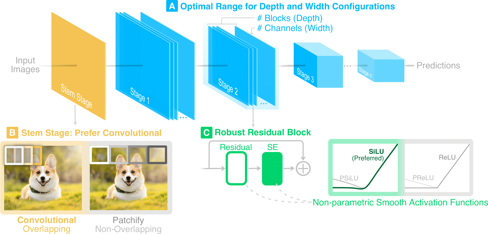
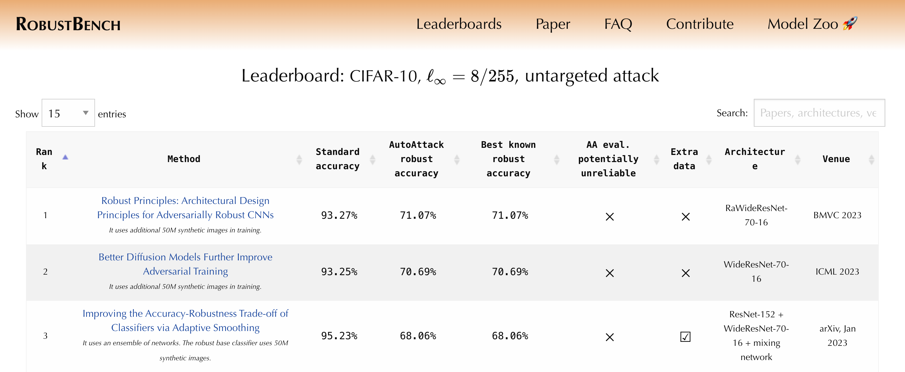

# Robust Principles: Architectural Design Principles for Adversarially Robust CNNs
[](https://arxiv.org/abs/2308.16258)
[](https://github.com/poloclub/wizmap/blob/main/LICENSE)

[Robust Principles: Architectural Design Principles for Adversarially Robust CNNs](https://arxiv.org/abs/2308.16258). ShengYun Peng, Weilin Xu, Cory Cornelius, Matthew Hull, Kevin Li, Rahul Duggal, Mansi Phute, Jason Martin, Duen Horng Chau. *British Machine Vision Conference (BMVC)*, 2023.

📺 <a href="https://www.youtube.com/watch?v=S-N1iuA0hAY">Video Presentation</a> &nbsp;&nbsp;&nbsp;&nbsp; 📖 <a href="https://arxiv.org/abs/2308.16258">Research Paper</a> &nbsp;&nbsp;&nbsp;&nbsp;  🚀<a href="https://shengyun-peng.github.io/papers/robust-principles">Project Page</a> &nbsp;&nbsp;&nbsp;&nbsp; 🪧 <a href="https://shengyun-peng.github.io/papers/posters/22_robarch.pdf">Poster</a>

<p align="center">
    
</p>

We aim to unify existing works' diverging opinions on how architectural components affect the adversarial robustness of CNNs. To accomplish our goal, we synthesize a suite of three generalizable robust architectural design principles: (a) optimal range for depth and width configurations, (b) preferring convolutional over patchify stem stage, and (c) robust residual block design through adopting squeeze and excitation blocks and non-parametric smooth activation functions. Through extensive experiments across a wide spectrum of dataset scales, adversarial training methods, model parameters, and network design spaces, our principles consistently and markedly improve AutoAttack accuracy: 1-3 percentage points (pp) on CIFAR-10 and CIFAR-100, and 4-9 pp on ImageNet.

## News
`Aug. 2023` - Paper accepted by BMVC'23 

`Sep. 2023` - 🎉 We are the top on [RobustBench CIFAR-10 $\ell_\infty = 8/255$ leaderboard](https://robustbench.github.io/#div_cifar10_Linf_heading)

<p align="center">
    
</p>

## Get Started
1. Prepare ImageNet following [installation steps 3&4](https://github.com/locuslab/fast_adversarial/tree/master/ImageNet). Skip step 4 if you don't plan to run Fast adversarial training (AT).
2. Set up python environment:
```bash
make .venv_done
```
3. (Optional) Register Weights & Biases [account](https://wandb.ai/site) if you want to visualize training curves.
4. Update "BASE" to ImageNet root directory and "WANDB_ACCOUNT" to your account name and validate by:
```bash
make check_dir
```

## Training & Evaluation
### Fast adversarial training (AT) - ResNet-50
```bash
make experiments/Torch_ResNet50/.done_test_pgd
```
To test other off-the-shelf models in [torchvision](https://pytorch.org/vision/stable/models.html#classification), add the model name in [MODEL.mk](MODEL.mk) and create a new make target in [Makefile](Makefile).

### Fast AT - RaResNet-50
```bash
make experiments/RaResNet50/.done_test_pgd
```

### Standard PGD AT - RaResNet-50
```bash
# Training
make experiments/RaResNet50/.done_train

# Evaluation on PGD
make experiments/RaResNet50/.done_test_pgd

# Evaluation on AutoAttack
make experiments/RaResNet50/.done_test_aa

# Pretrained models evaluated on AutoAttack
make experiments/RaResNet50/.done_test_pretrained
```

## Trained Model Weights
### ImageNet $\ell_\infty$

| Architecture | #Param | Clean(%) | AA(%) | PGD100-2(%) | PGD100-4(%) | PGD100-8(%) |
| :--: | :--: | :--: | :--: | :--: | :--: | :--: |
| [RaResNet-50](https://huggingface.co/poloclub/Ra-Principles/blob/main/ra_resnet50_imagenet.pt)  | 26M | 70.17 | 44.14 | 60.06 | 47.77 | 21.77 |
| [RaResNet-101](https://huggingface.co/poloclub/Ra-Principles/blob/main/ra_resnet101_imagenet.pt) | 46M | 71.88 | 46.26 | 61.89 | 49.30 | 23.01 |
| [RaWRN-101-2](https://huggingface.co/poloclub/Ra-Principles/blob/main/ra_wrn101_2_imagenet.pt) | 104M | 73.44 | 48.94 | 63.49 | 51.03 | 25.31 |

### CIFAR 10 & 100 $\ell_\infty, \epsilon = 8/255$

| | | | CIFAR-10 | | | CIFAR-100 | |
| :--: | :--: | :--: | :--: | :--: | :--: | :--: | :--: |
| Method | Model | Clean(%) | AA(%) | PGD20(%) | Clean(%) | AA(%) | PGD20(%) |
| [Diff. 1M](https://arxiv.org/abs/2302.04638) | RaWRN-70-16 | 92.16 | 66.33 | 70.37 | 70.25 | 38.73 | 42.61 |
| [Diff. 50M](https://arxiv.org/abs/2302.04638) | [RaWRN-70-16](https://huggingface.co/poloclub/Ra-Principles/blob/main/ra_wrn70_16_cifar10.pt) | 93.27 | 71.09 | 75.29 | - | - | - |

## Citation

```bibtex
@article{peng2023robust,
  title={Robust Principles: Architectural Design Principles for Adversarially Robust CNNs},
  author={Peng, ShengYun and Xu, Weilin and Cornelius, Cory and Hull, Matthew and Li, Kevin and Duggal, Rahul and Phute, Mansi and Martin, Jason and Chau, Duen Horng},
  journal={arXiv preprint arXiv:2308.16258},
  year={2023}
}
```

## Contact
If you have any questions, feel free to [open an issue](https://github.com/poloclub/robust-principles/issues/new) or contact [Anthony Peng](https://shengyun-peng.github.io/) (CS PhD @Georgia Tech).


